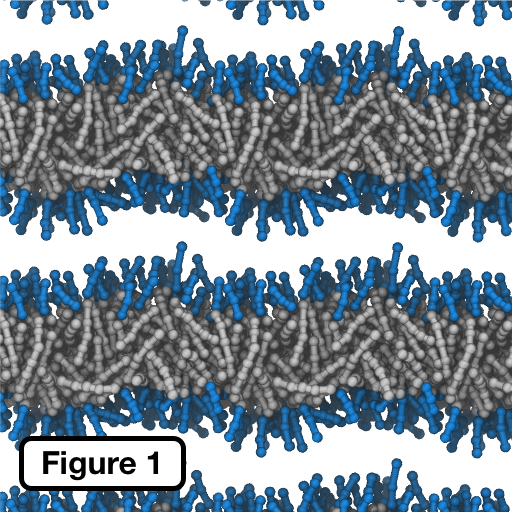

# DPD C#

_A simple dissipative particle dynamics code written in C#_

**Note: this document is obviously incomplete at this stage!**

This code implements a version of the dissipative particle dynamics (DPD) approach of [Hoogerbrugge and Koelman](http://iopscience.iop.org/article/10.1209/0295-5075/19/3/001/pdf), with a particular emphasis on the application of DPD to the study of self-assembling lipid systems after Venturoli and co-workers [[1]](http://pubs.rsc.org/en/content/articlelanding/1999/qu/a906472i) [[2]](https://www.cell.com/biophysj/fulltext/S0006-3495(05)73243-4).

## Requirements

* [.NET Core](https://www.microsoft.com/net/learn/get-started/)

## Platform compatibility

In principle, anything that supports .NET Core!

## Example usage

For a quick and simple test, run the provided `example.dpd` simulation:

	dotnet run -c Release example.dpd

On my machine, this produced the following (partial) output:

	DPD simulation parameters:
		step_no is 1
		max_steps is 25000
		save_every is 1000
		print_every is 1000
		delta_t is 0.01
		ran1 initialised with -1
		rcut is 1
		lambda is 0.65
		sigma is 3
		kBT is 1
		cell is 10, 10, 10
	3 site types:
		w; (internal 0)
		h; (internal 1)
		t; (internal 2)
	2 molecule types:
		lipid; 115 counts in system:
			13 sites
				h, (id 1)
				h, (id 1)
				h, (id 1)
				t, (id 2)
				t, (id 2)
				t, (id 2)
				t, (id 2)
				t, (id 2)
				t, (id 2)
				t, (id 2)
				t, (id 2)
				t, (id 2)
				t, (id 2)
			12 bonds
				1 - 2 : eq length 0.700, k 100.000
				2 - 3 : eq length 0.700, k 100.000
				4 - 5 : eq length 0.700, k 100.000
				5 - 6 : eq length 0.700, k 100.000
				6 - 7 : eq length 0.700, k 100.000
				7 - 8 : eq length 0.700, k 100.000
				9 - 10 : eq length 0.700, k 100.000
				10 - 11 : eq length 0.700, k 100.000
				11 - 12 : eq length 0.700, k 100.000
				12 - 13 : eq length 0.700, k 100.000
				3 - 4 : eq length 0.700, k 100.000
				3 - 9 : eq length 0.700, k 100.000
			8 angles
				1 - 2 - 2 : eq length 3.142, k 20.000
				3 - 4 - 4 : eq length 3.142, k 20.000
				5 - 6 - 6 : eq length 3.142, k 20.000
				5 - 6 - 6 : eq length 3.142, k 20.000
				7 - 6 - 6 : eq length 3.142, k 20.000
				7 - 8 - 8 : eq length 3.142, k 20.000
				9 - 10 - 10 : eq length 3.142, k 20.000
				11 - 10 - 10 : eq length 1.571, k 3.000
		water; 1505 counts in system:
			1 sites
				w, (id 0)
			0 bonds
			0 angles
	3 interactions (defined in kBT):
	              	           w	           h	           t
		           w	   25.000	   15.000	   80.000
		           h	   15.000	   35.000	   80.000
		           t	   80.000	   80.000	   25.000
	3000 sites
	Friction coefficient is 4.5 ( as sigma = 3 )
	Bead density is 3 per cubic Rc
	Step 1/25000, sim time 0.01, CPU time 0s:
		Total energy     : 82611.000952
		Kinetic energy   :     0.000000 ( Average     0.000000, target kBT     1.000000, current kBT     0.000000
		Nonbonded energy : 17012.909054 ( Average     0.667697 from 25480 collisions )
		Bond energy      : 63770.842239 ( Average    23.105378 )
		Angle energy     :  1827.249659 ( Average     0.662047 )
		Pressure         : 31750.091898   -74.144343  -979.841738
		                     382.087685 26738.832904 -11612.713943
		                    -895.692263 -11612.713943 -134962.321490
		System centre of mass =    -0.371813    -0.536461    -0.466457
		Net system momentum   =     0.000000     0.000000     0.000000

	Step 1000/25000, sim time 10.00, CPU time 13s:
		Total energy     : 18461.168546
		Kinetic energy   :  5035.358600 ( Average     1.678453, target kBT     1.000000, current kBT     1.118969
		Nonbonded energy : 11588.845911 ( Average     0.697325 from 16619 collisions )
		Bond energy      :  1000.591255 ( Average     0.362533 )
		Angle energy     :   836.372780 ( Average     0.303034 )
		Pressure         :    25.097875     0.023494    -0.262328
		                       0.737263    22.137103    -0.039258
		                       0.494367    -0.039258    22.651976
		System centre of mass =     0.044853    -0.043127     0.040210
		Net system momentum   =     0.000000     0.000000     0.000000

After a few thousand timesteps, the system should move from disorder to form a lamellar lipid bilyer membrane system (**Fig. 1**, lipid "tails" are gray, lipid "head" region is blue, water not shown).

## Notes

- The PDB file written by `gen_system.py` actually contains the system coords scaled by 10. This is to avoid problems with e.g. [VMD](http://www.ks.uiuc.edu/Research/vmd/) inferring bond information from distances between particles rather than using the `CONECT` entries in the PDB file. **The coordinates etc in the actual DPD sim file are unscaled**.
- The use of `UnwrapTrajectories` from [MolecularUtilities](https://github.com/JohnGrime/MolecularUtilities/) can prove to be very useful in visualizing the output, to ensure bonds do not "wrap" across periodic boundaries resulting in a visual mess.
